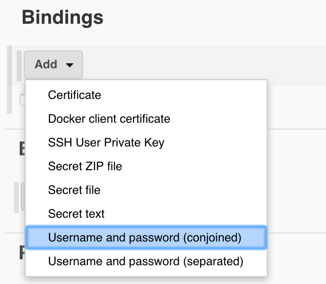

# Genentech-Screenshots
Screenshot automation for Access Solutions, Kadcyla HCP, and Kadcyla Patient sites.

### Pre-requisites:
1) Node JS (>v4): `brew install node`
2) Maven 3.x: `brew install maven`
3) Jenkins: `brew install jenkins`

### Set up

1. Install [Jenkins](https://jenkins.io/download/) for your testing environment. Once installation is complete, go to localhost:8080 in your browser. First time users will be prompted for a password. The admin password is stored in `~/.jenkins/secrets/initialAdminPassword`. After entering the password, users will want to select "Install suggested plugins".

   If there is an issue where the "Jenkins" appears to be offline and does not allow you to download plugins, the update center URL needs to use the http protocol over the https protocol. Update the following file: `~/.jenkins/hudson.model.UpdateCenter.xml` and change the Update Center's URL to `http://updates.jenkins.io/update-center.json`.

   You can go to [Plugins Manager](http://localhost:8080/pluginManager/available) and install the following plugins: Git plugin, NodeJS Plugin, Maven Integration Plugin, Credentials Binding Plugin, Workspace Cleanup Plugin.

   Then you will need to go to the [Global Tool Configuration](http://localhost:8080/configureTools/) and update the installation of the Java JDK, Maven, and NodeJS.

   For the Java SDK, you will want to click on the "Add JDK" button. Then uncheck "Install Automatically" and insert the JAVA_HOME path. The JAVA_HOME path is the same as the JAVA_HOME path on your terminal's profile.

   For Maven, you will want to click on the "Add Maven" button, then uncheck "Install Automatically" and insert the MAVEN_HOME path. The MAVEN_HOME path is the same as the M2 path on your terminal's profile.

   For NodeJS, you will want to click on the "Add NodeJS" button. You will want to install version nodeJS 4.4.6.

2. Now you need to set the AWS credentials and Github credentials.

   On the Jenkins dashboard on the left click "Credentials".

    

   Then under "Stores scoped to Jenkins" click "Jenkins". 

   

   Now click on "Global credentials". On the far left click "Add Credentials". Here you will specify the credential type and required login/key information. For S3 services set the kind to "Username and password". For Github set the kind to "SSH Username with private key".

   

3. Once the credentials are filled in. Return to the dashboard by clicking on the Jenkins logo on the top left. At the dashboard click "New Item" on the far left. Here we are creating a new Job. Set the name of the Job and click "Maven project". Then click "Ok". 

   

   Once the Job is created set in the required parameters for the Job. The screenshot automation takes in several arguments and each parameter is associated to an argument. In the General tab check "This project is parameterizd." Then click "Add parameter." From the list select the appropriate type.

   

   Fill in the parameter details. Default values will be used when a job gets built automatically. Then click "Add Parameter" to add the next parameter. Repeat adding parameters until all the needed parameters are set. 
   
   For choice parameters you need to list the choices per line.
   

   For string parameters place the needed value in the "Default Value" field.
   

   For boolean parameters check the box to set the parameter to be true.
   

   Below are all the parameters.

   |  Name            |  Type |Description | 
   | -------------    | --- |--- |
   | DEVELOPMENT_ENVIRONMENT | choice (`dev` `stage` `prod` `local`)  | Run the screenshot automation on a developer, stage, production, or local environment | 
   | JOB_TYPE | string | Runs a specific automation job based on ID or job name. |
   | SAVE_PATH         | string |Path where the screenshots are stored. Defaults to "target/screenshots" |
   | PDF_OUTPUT_PATH  | string |Path to created PDF. If not set defaults to SAVE_PATH | 
   | S3_BUCKET        | string |Name of Bucket where PDF is stored |
   | S3_REGION        | string |Region where the bucket is at. Defaults to us-east-1 |
   | MERGE_BREAKPOINT | boolean | Breaks the merging of desktop and mobile screenshots if false. Desktop and mobile screenshots are placed in separated PDFs and are zipped up when sent to S3. If true then both desktop and mobile screenshots are saved as one PDF and a single PDF is sent to S3. Defaults to true. |

4. Under Source Code management check Git and set the URL of the Github repository of the automation code. Then set the git credentials underneath for repo access. 

   Select the branch where the automation code resides.

5. Under Build Trigger, determine what your needs will be (polling for commits, run between time periods).

6. Under Build Environment, check "Use secret text(s) or files(s)" to configure the AWS credentials.
   
    

   Then under Bindings click add and select Username and password (conjoined). 
   
   

   Select "Specific credentials" and select the AWS credentials set from step 2. Now for "Username Variable" set the value to AWS_ACCESS_KEY and the "Password Variable" to AWS_SECRET_KEY.
   Now the AWS credentials and set parameters from step 3 are usable in the shell/bash.
   
   | Name | Type |
   | --- | --- |
   | ACCESS_KEY | Username Variable |
   | SECRET_KEY | Password Variable |

7. Under Build Environment, enable `Provide Node & npm bin/folder to PATH`.

   Select the NodeJS installation dropdown and click on the version 4.4.6.

8. Under Build Environment, enable `Delete workspace before build starts`. We want to make sure the workspace is always clean before starting a build.

9. Under Pre Steps, you will want to click on the dropdown for `Add pre-build step' and click on `Execute Shell`.

   In the text area for `Command`, you will want to insert `npm install` to download the chromedriver.

10. Under "Build", fill in `Goals and options` with the following:
   ``` compile exec:java -Dexec.cleanupDaemonThreads=false -Dexec.args=" savepath=$SAVE_PATH pdfoutput=$PDF_OUTPUT_PATH s3-bucket=$S3_BUCKET s3-region=$S3_REGION jobtype=$JOB_TYPE pdfbreakpoint=$MERGE_BREAKPOINT environment=$DEVELOPMENT_ENVIRONMENT aws-accesskey=$ACCESS_KEY aws-secretkey=$SECRET_KEY"```
