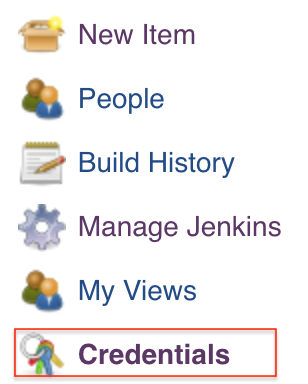

1. Install [Jenkins](https://jenkins.io/download/) for your testing environment. Once Jenkins is up go to your browser and connect to the Jenkins Server. When connected for the first time Jenkins will ask for a password stored in your system. Paste in the password and continue. Then select "Install suggested plugins" to be installed. Once the plugins finish being installed setup an Admin account.

2. Now we need to set the AWS credentials and Github credentials. If the AWS credentials for the S3 service are [locally saved](http://docs.aws.amazon.com/sdk-for-java/v1/developer-guide/setup-credentials.html#setup-credentials-setting) you can decide to either use the local credentials or specify the credentials to Jenkins. Skip step 6 if using local credentials. 

   On the Jenkins dashboard on the left click "Credentials".

    

   Then under "Stores scoped to Jenkins" click "Jenkins". 
   
   

   Now click on "Global credentials". On the far left click "Add Credentials". Here you will specify the credential type and required login/key information. For S3 services set the kind to "Username and password". For Github set the kind to "SSH Username with private key".
   
   

3. Once the credentials are filled in. Return to the dashboard by clicking on the Jenkins logo on the top left. At the dashboard click "New Item" on the far left. Here we are creating a new Job. Set the name of the Job and click "Freestyle project". Then click "Ok". 

   

   Once the Job is created set in the required parameters for the Job. The screenshot automation takes in several arguments and each parameter is associated to an argument. In the General tab check "This project is parameterizd." Then click "Add parameter." From the list select the appropriate type.
   
   
   
   Fill in the parameter details. Default values must be set if they are used when testing. Then click "Add Parameter" to add the next parameter. Repeat adding parameters until all the needed parameters are set. 
   
   For choice parameters you need to list the options per line.
   
   
   For string parameters place the needed value in the "Default Value" field.
   
   
   For boolean parameters check the box to set the parameter to be true.
   

   Below are all the parameters.

   |  Name            |  Type |Description | 
   | -------------    | --- |--- |
   | DOMAIN | choice (`dev` `stage` `prod` `local`)  | Run the screenshot automation on a developer, stage, production, or local environment | 
   | JOB_TYPE | choice (`Access_Solutions` `Kadcyla_HCP` `Kadcyla_Patient`)| Runs a specific automation job for either Access Solutions, Kadcyla HCP or Kadcyla Patients
   | THREAD_COUNT | string | Integer value representing the number of allowed threads of WebDriver workers. Default value is 1. Make sure the value is reasonable for the system. | 
   | CHROMEDRIVER_PATH| string |Path to the chromedriver. If not set defaults to the [latest](https://www.npmjs.com/package/chromedriver) from ```npm install``` |
   | SAVE_PATH         | string |Path where the screenshots and logs are saved |
   | PDF_OUTPUT_PATH  | string |Path to created PDF. If not set defaults to SAVE_PATH | 
   | PDF_NAME         | string |Name of PDF. If not set defaults to automation class name|
   | S3               | boolean |Send generated pdfs to an S3 Service if set to TRUE| 
   | S3_BUCKET        | string |Name of Bucket where PDF is stored |
   | S3_PDF_KEY       | string |Name of key for PDF |
   | S3_REGION        | string |Region where the bucket is at. Defaults to us-east-1 |
   | AWS_LOCAL        | boolean |Uses local AWS credentials if TRUE |

4. Under Source Code management check Git and set the URL of the Github repository of the testing code. Then set the git credentials underneath for repo access. 

   Select the branch where the automation code resides.

5. Under Build Trigger determine what your needs will be (polling for commits, run between time periods).

6. If the setup requires using the AWS login and password credentials under Build Environment check "Use secret text(s) or files(s)". 
   
    

   Then under Bindings click add and select Username and password (conjoined). 
   
   

   Select "Specific credentials" and select the AWS credentials set from step 2. Now for "Username Variable" set the value to AWS_ACCESS_KEY and the "Password Variable" to AWS_SECRET_KEY.
   Now the AWS credentials and set parameters from step 3 are usable in the shell/bash.
   
   | Name | Type |
   | --- | --- |
   | ACCESS_KEY | Username Variable |
   | SECRET_KEY | Password Variable |

7. Under Build click "add setup" and select "Execute shell" if using mac/linx or "Windows bash" if using windows. Maven and npm are needed. Make sure both are installed and are callable in the shell/bash.
   In the command textbox set the build commands to execute the screenshot automation.
   
   > Downloads chromedriver
   ```
   npm install
   ```
   > Build and run the automation job, remove the ACCESS_KEY and SECRET_KEY if they are not set. 
   ```
   mvn compile exec:java \
       -Dexec.cleanupDaemonThreads=false \
       -Dexec.args=" \
           savepath=$SAVE_PATH \
           pdfoutput=$PDF_OUTPUT_PATH \ 
           s3=$S3 \
           aws-local=$AWS_LOCAL \ 
           s3-bucket=$S3_BUCKET \
           s3-pdfkey=$S3_PDF_KEY \
           s3-region=$S3_REGION \
           jobtype=$JOB_TYPE \
           domain=$DOMAIN \
           threadcount=$THREAD_COUNT \
           aws-accesskey=$ACCESS_KEY \
           aws-secretkey=$SECRET_KEY" 
   ```
